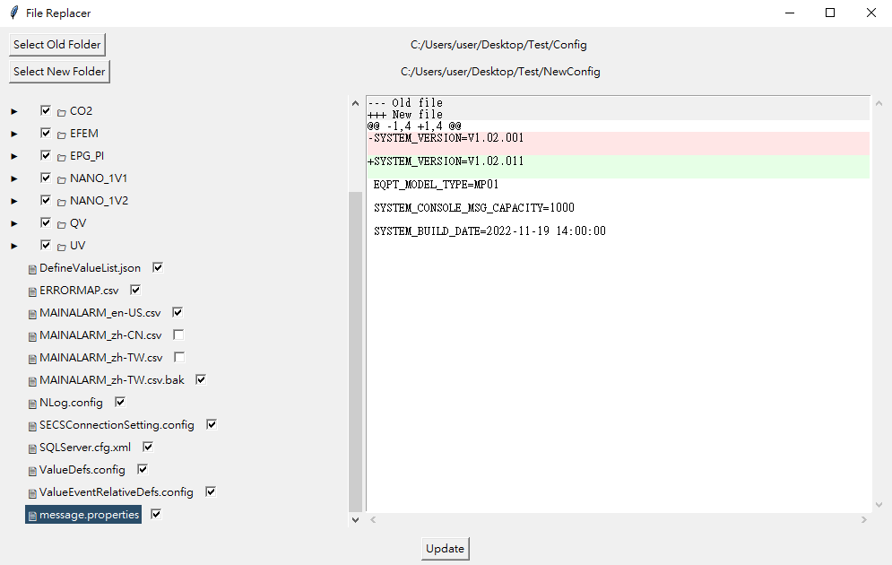

# Replacer
This application helps manage and replace files in a folder containing both old and new versions. It provides a clear view of the files and highlights the differences between versions, making updates and comparisons simple and efficient.

[中文版](README_ZHTW.md)
## GUI Operation Guide

### Buttons
- **Select Old Folder**

    Select the folder containing the files you want to replace.

- **Select New Folder**

    Select the folder containing the files to use as the update source.

- **Update**

    Replace the old files with the corresponding updated files from the source folder.

### File Check Box

    Checking a box indicates that the corresponding file will be replaced. Leaving the box unchecked preserves the original file.

### File Browser Section

    The left pane displays all the files in the selected folders.

### File Comparison Section

    When a file is selected in the File Browser Section, its differences between the old and new versions are displayed here. Removed content is highlighted with a red background (-), and added content is highlighted with a green background (+), allowing users to clearly understand the differences between the two files.

